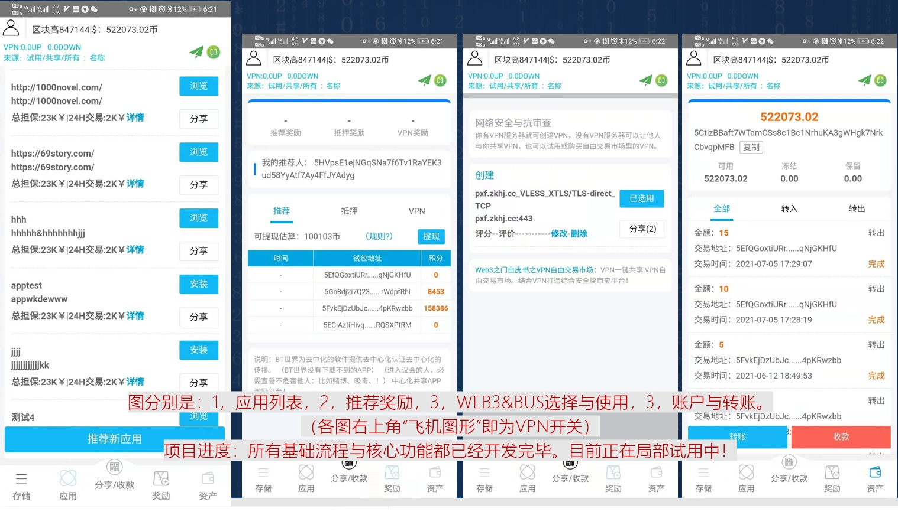
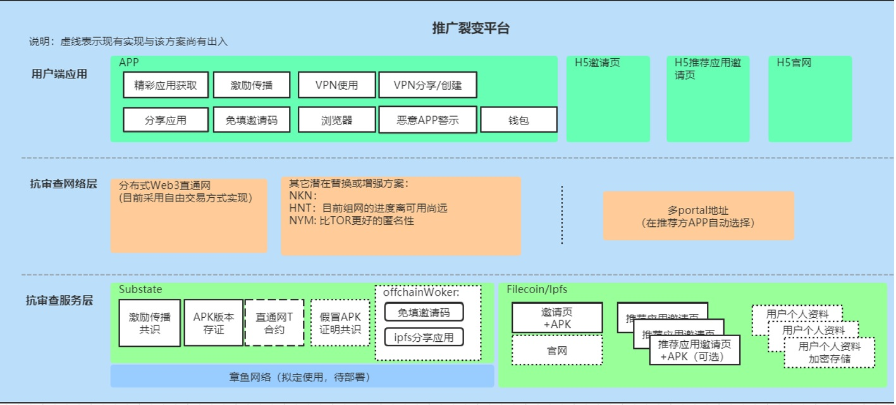
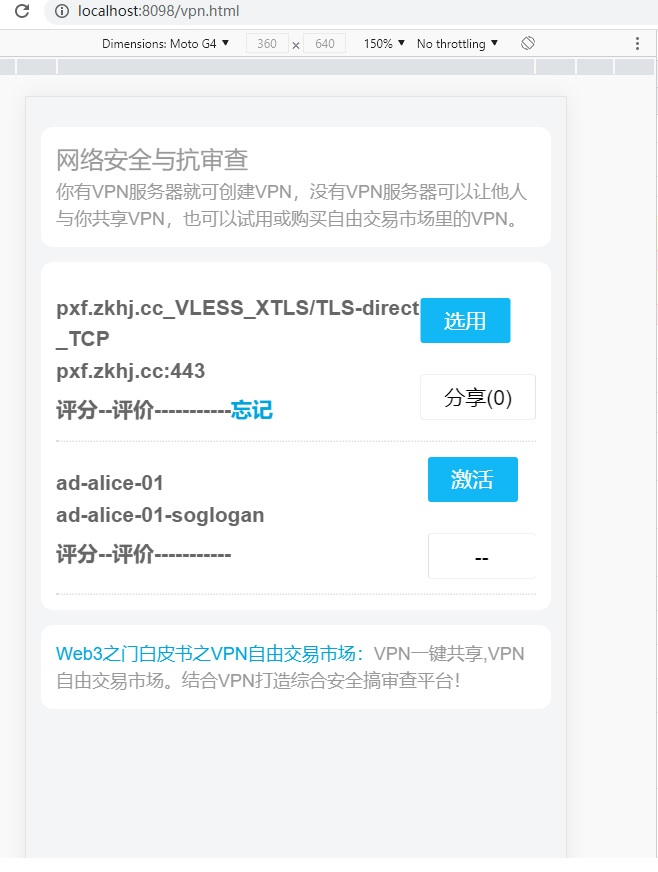

# 2021Wanxiang-Blockchain-Hackathon-Web3pioneer

# 本次上传的内容，代码部分主要为新增加的隐私网络的交易与管理
1，code/substrate-web3p/node-web3p-2  可运行的web3区块链节点程序  
    code/substrate-web3p/src  隐私网络的 pallet 代码  
2，code/android-web3p/SBrowser-release.apk  的  web3p的  android 包  
3，code/front-h5  管理端框架与部分代码  

android运行的图：  

整体架构图：  

code/front-h5,最新的隐私网络管理：  
